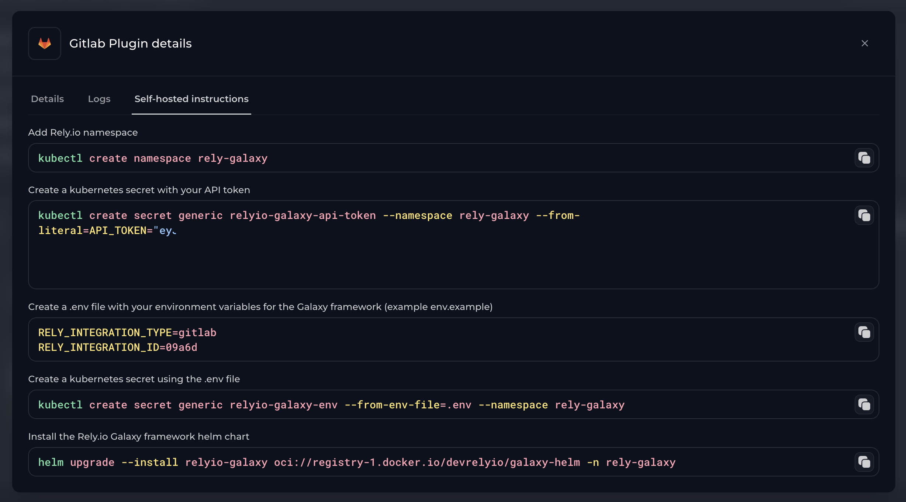
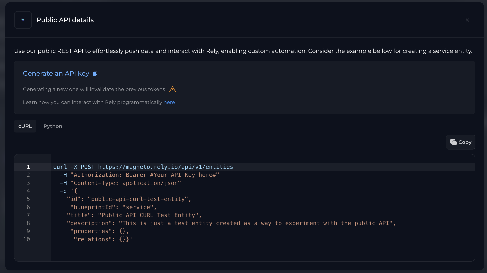

# Galaxy

[](https://opensource.org/licenses/Apache-2.0) [](https://github.com/Rely-io/galaxy-oss/actions/workflows/release_on_tag.yml)

Galaxy is a solution developed by Rely.io that enables seamless integration of third-party systems with our internal developer portal. With Galaxy, you can leverage existing [integrations](https://www.rely.io/product/integrations) to ingest your data into Rely.io or create custom integrations tailored to your needs.

Built with Python, Galaxy offers reusable components, making it easy to add integrations to the framework. It employs JQ syntax to accurately map data from third-party APIs into the Rely data model.

## Installation

### Pre-requisites

To setup an integration with a third-party tool you must create a plugin for it. If you haven't done it yet, please follow the instructions on the next step "*Creating the plugin*". Otherwise feel free to skip this step.

#### Creating the plugin

In your Rely.io application, go to `Portal Builder` > `Plugins` and select "*Add Data Source*". Select the tool you'll be using and tick the "*Is your plugin self hosted?*" option. Fill the required information and submit.

#### Obtaining the plugin token

The plugin token connects your plugin to our API and allows authenticated communication to happen between the two.

There are 2 ways to do this.

##### In Rely.io

Select *"View details"* on the plugin you want to setup and move to the *"self-hosted instructions"* tab. You'll notice there's a command to create a Kubernetes secret that already makes use of your token. You may extract the token from here or simply use the command directly in step 2 of the Helm install detailed below.



##### Programmatically

First obtain a personal long lived token by going to your organization's `Settings` and clicking *"Generate an API key"*. This key will be used to communicate with our API.

Select *"View details"* on the plugin you're using and copy the plugin's ID.



Now in a terminal, make an API call to our API replacing the variables with the obtained values

  ```bash
    curl --request GET --url https://magneto.rely.io/api/v1/legacy/plugins/{PLUGIN_ID}/token --header 'Authorization: Bearer {API_KEY}'
  ```

And now you have obtained the plugin token to use during installation.

### Helm

#### Fresh Install

1. Create a Kubernetes namespace (alternatively, you may skip this step and use a different workspace in step 2)

   ```bash
   kubectl create namespace rely-galaxy
   ```

2. Create a Kubernetes secret with your plugin token:

   ```bash
   kubectl create secret generic relyio-galaxy-api-token --namespace rely-galaxy --from-literal=API_TOKEN="YOUR-PLUGIN-TOKEN"
   ```

3. Create a `.env` file with your environment variables for the Galaxy framework (example [`env.example`](env.example)):

   ```dotenv
   RELY_INTEGRATION_TYPE=<the name of the integration, ex: gitlab>
   RELY_INTEGRATION_ID=<go to rely app and get the rely integration installation id>
   ```

4. Create a Kubernetes secret using the `.env` file:

   ```bash
   kubectl create secret generic relyio-galaxy-env --from-env-file=.env --namespace rely-galaxy
   ```

5. Install the **Rely.io Galaxy Framework** helm chart :

   ```bash
   helm upgrade --install relyio-galaxy oci://registry-1.docker.io/devrelyio/galaxy-helm -n rely-galaxy
   ```

#### Upgrade

##### To the latest version

```bash
helm upgrade relyio-galaxy oci://registry-1.docker.io/devrelyio/galaxy-helm -n rely-galaxy
```

##### To a specific version

```bash
helm upgrade relyio-galaxy oci://registry-1.docker.io/devrelyio/galaxy-helm -n rely-galaxy --version 1.0.0
```

#### Configuration Update

##### Environment variables

  Update the `relyio-galaxy-env` secret with any variables you need:

  ```bash
  kubectl patch secret relyio-galaxy-env --namespace rely-galaxy --patch '{
      "data": {
          "RELY_INTEGRATION_ID": "'"$(echo -n '<your_rely_integration_id>' | base64)"'"
      }}'
  ```

### Docker

You can simply run Galaxy by:

```bash
docker run --env-file .env devrelyio/galaxy:latest
```

The content of the .env file is as follows:

```dotenv
RELY_INTEGRATION_TYPE=<the name of the integration, ex: gitlab>
RELY_API_URL=https://magneto.rely.io/
RELY_API_TOKEN=<go to rely app and get the token for the plugin installation>
RELY_INTEGRATION_ID=<go to rely app and get the rely integration installation id>
```

### Contributing

Interested in contributing? Great!

Start by reviewing our contribution guidelines, then contact us at support@rely.io for assistance in getting started.

### License

Galaxy is licensed under the [Apache License 2.0](LICENSE).
